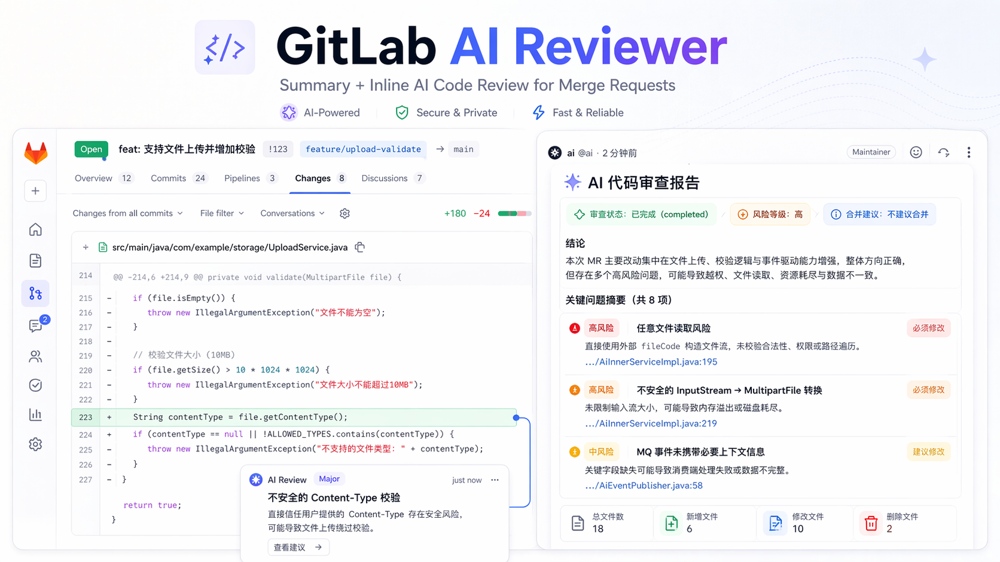
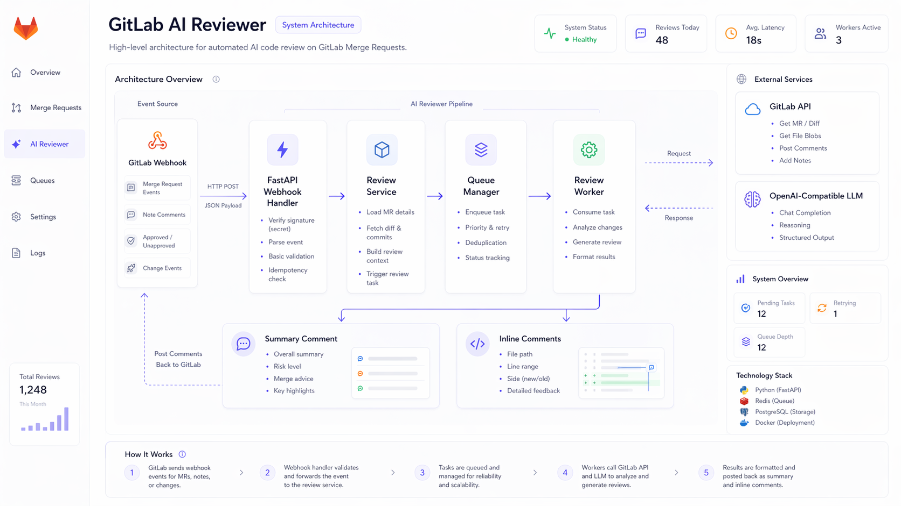
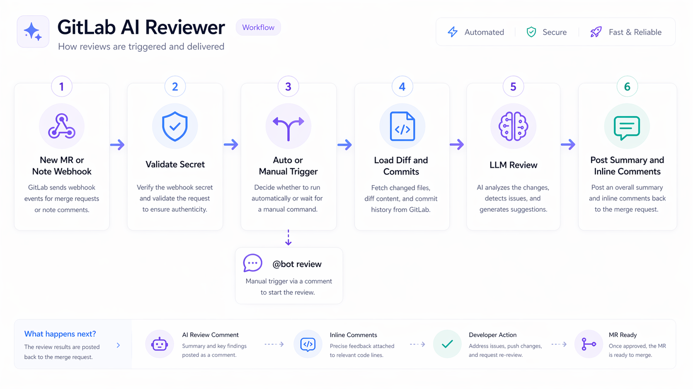
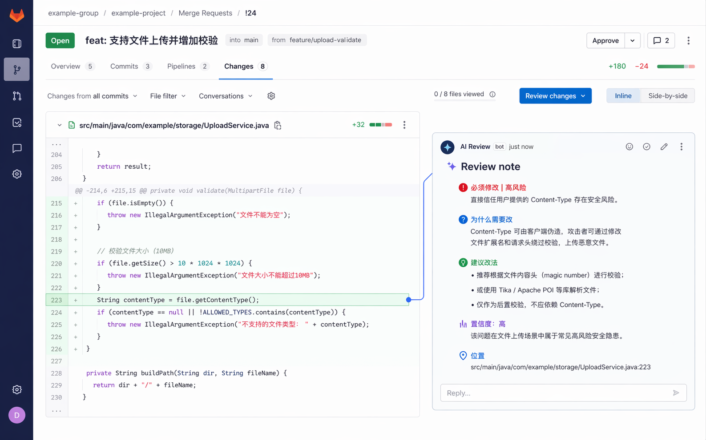

# GitLab AI Reviewer

[简体中文 README](README.zh-CN.md) | [English README](README.en.md)

An AI-powered reviewer service for GitLab Merge Requests that turns webhook events into structured review output, summary comments, and inline feedback directly inside the MR discussion flow.

这是一个面向 GitLab Merge Request 的 AI 代码评审服务。它把 GitLab webhook 事件转换成结构化审查结果，并直接在 MR 讨论流里生成总评评论与行级评论。

> Built for self-hosted GitLab teams that want practical AI review inside the merge request workflow.  
> 面向自建 GitLab 团队，目标是在现有 MR 流程中提供实用、可部署、可定制的 AI 代码审查能力。

## Highlights / 亮点

- **Ready to self-host** with Docker Compose
- **Supports auto review and `@bot review` manual trigger**
- **Posts both summary review and inline comments**
- **OpenAI-compatible gateway friendly**
- **Prompts can be mounted and customized without rebuilding**
- **Includes tests, local debugging notes, and deployment docs**

### What you get / 你会得到什么

- An **AI summary report** directly in the MR discussion thread
- **Inline review notes** attached to concrete changed lines when positions can be resolved
- A lightweight service that is easy to self-host, debug, and customize
- 一个直接出现在 MR 讨论区的 **AI 总评报告**
- 在可定位场景下挂到具体代码行上的 **AI 行级评论**
- 一个便于自部署、调试和二次定制的轻量 reviewer 服务

---

## Quick links / 快速入口

- 中文文档：[`README.zh-CN.md`](README.zh-CN.md)
- English docs: [`README.en.md`](README.en.md)
- Architecture / 架构说明：[`docs/ARCHITECTURE.md`](docs/ARCHITECTURE.md)
- Local debugging / 本地联调：[`docs/LOCAL_DEBUG.md`](docs/LOCAL_DEBUG.md)
- Local GitLab setup / 本地 GitLab 联调：[`docs/LOCAL_GITLAB_SETUP.md`](docs/LOCAL_GITLAB_SETUP.md)
- Webhook checklist / Webhook 清单：[`docs/WEBHOOK_CHECKLIST.md`](docs/WEBHOOK_CHECKLIST.md)
- Contributing / 贡献指南：[`CONTRIBUTING.md`](CONTRIBUTING.md)
- Security / 安全策略：[`SECURITY.md`](SECURITY.md)

---

## Visual overview / 图示概览

### Architecture / 架构图

### Workflow / 流程图

### Example AI summary / AI 总评示意

### Example inline review / 行级评论示意

---

## Project status / 项目状态

This repository is currently best suited for:

- local deployment
- proof of concept
- small-team internal usage
- customization and secondary development

当前仓库更适合：

- 本地部署
- PoC 验证
- 小团队内部试用
- 二次开发与定制

It is **not yet positioned as a hardened enterprise platform** with guarantees around HA, fine-grained permissions, or very large MR handling.

它**暂不定位为企业级高可用平台**，不承诺超大 MR、细粒度权限体系或高可用集群能力。

---

## License

Apache-2.0. See [`LICENSE`](LICENSE).
